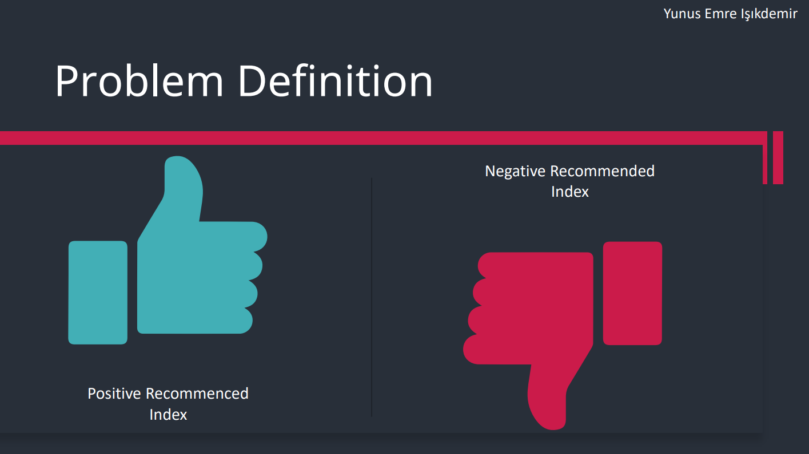
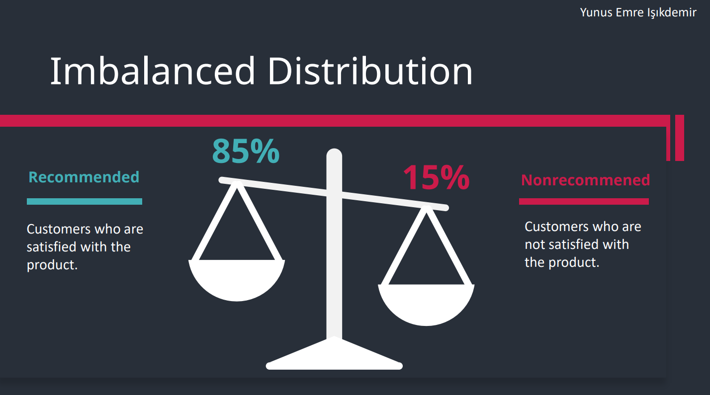
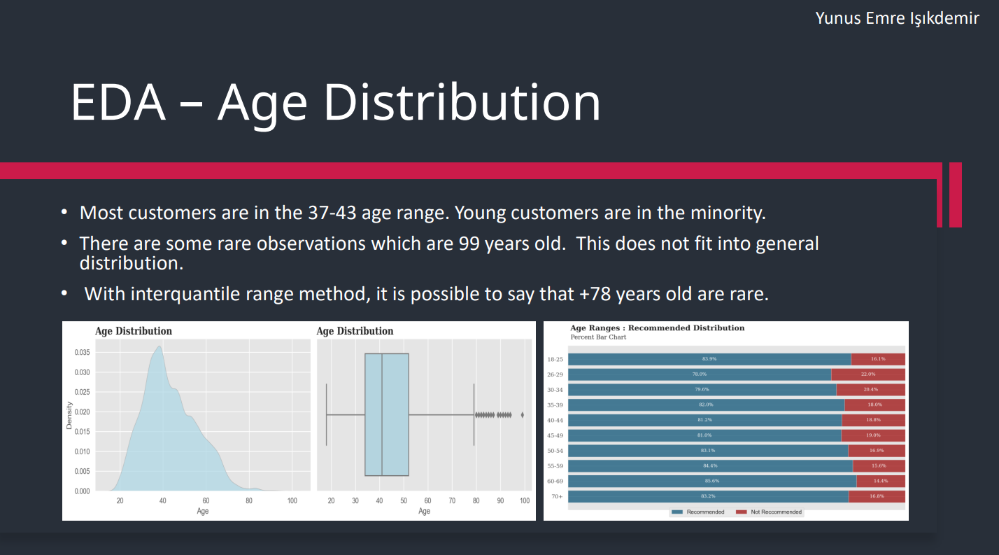
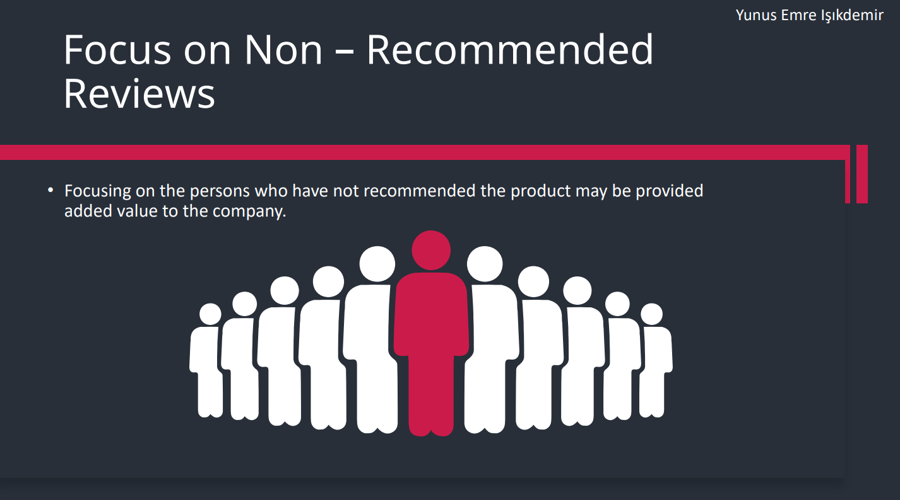
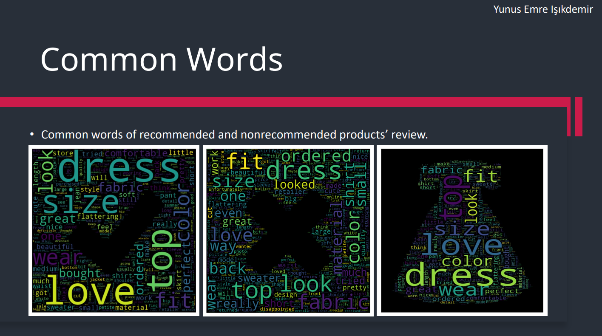
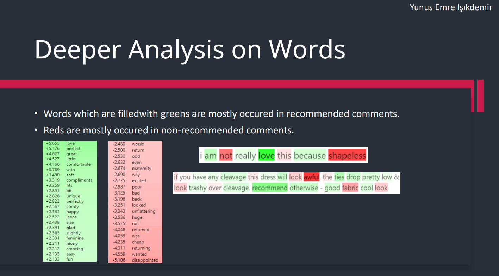

### Review Based Product Recommender System

The objective of this project is to develop a recommender system using natural language processing techniques. The dissatisfaction factors associated with various types of products are identified through an analysis of customer reviews. This analysis involves the utilization of n-gram and word distribution techniques across the entire review dataset. The classification of customers who are likely to recommend or not recommend a product is accomplished via the application of machine learning algorithms.

  

 

### Distribution of Categories

The distribution of the dataset is imbalanced, with a significantly larger number of samples belonging to the recommended class, resulting in a highly skewed distribution.

  

### Exploratory Data Analysis

The ages of the customers are categorized and subsequently analyzed to determine which age groups are more likely to recommend products. This analysis aims to enhance the revenue of the company by targeting specific customer groups.

  

The histograms are examined to ascertain the precise number of customers' inclinations.

  

Concentrating on individuals who have not recommended the product can potentially provide additional value to the company.

  

The common words associated with both recommended and non-recommended products are investigated to identify the underlying reasons for dissatisfaction.

  

The analysis is also examined from an explainable AI perspective to determine which words are more prevalent in categorizing the customers.

  

